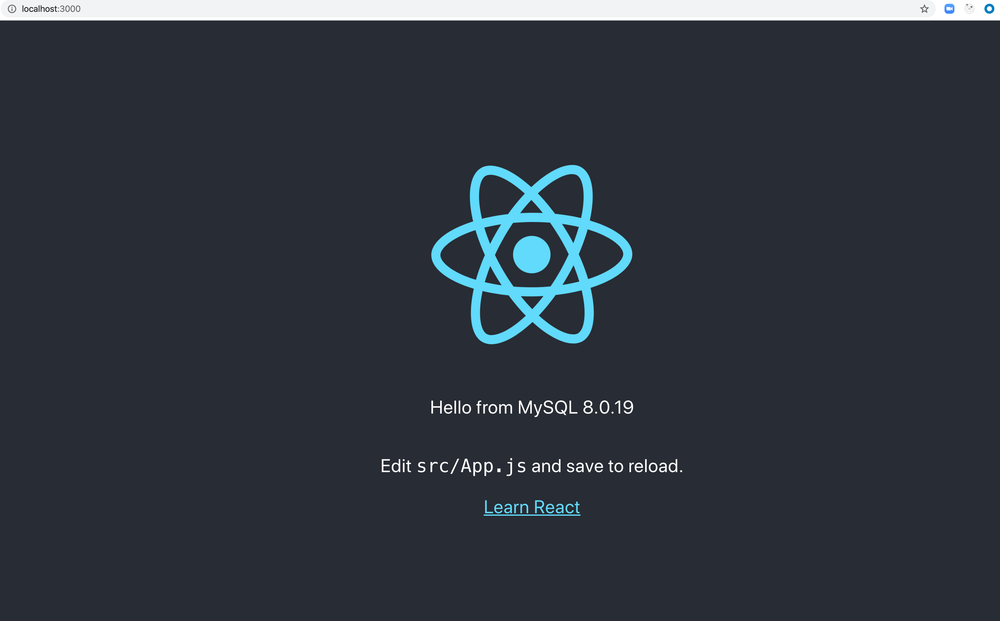

## React/Node/MySQL Compose sample application
## Deploy with docker-compose

```
$ docker-compose up -d
```


After the application starts, navigate to `http://localhost:3000` in your web browser.



The backend service container has the port 80 mapped to 80 on the host.
```
$ curl localhost:80
{"message":"Hello from MySQL 8.0.19"}
```

Stop and remove the containers
```
$ docker-compose down
```
